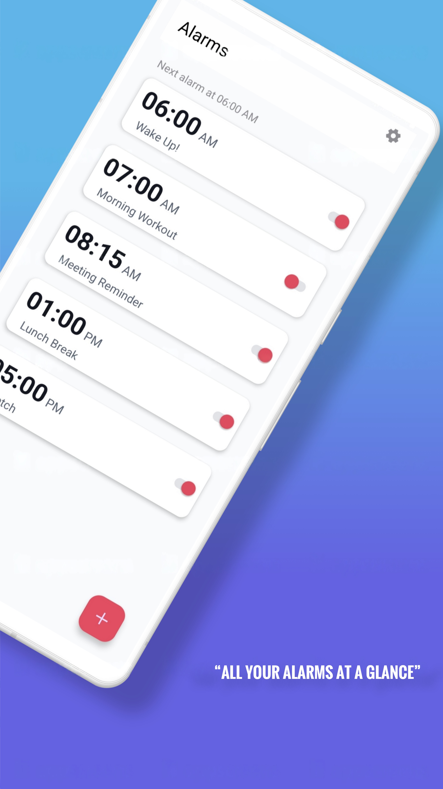
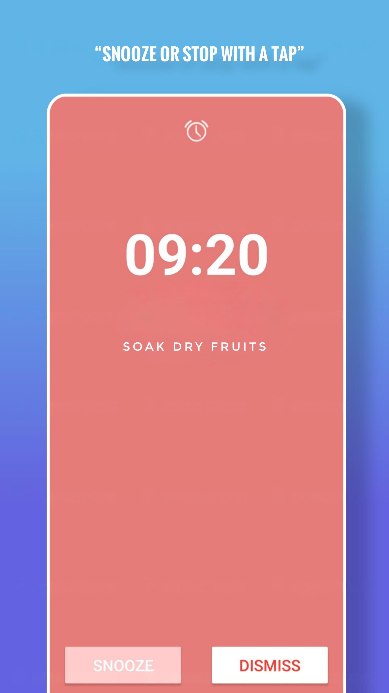
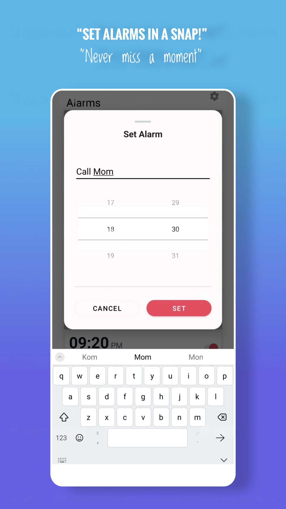
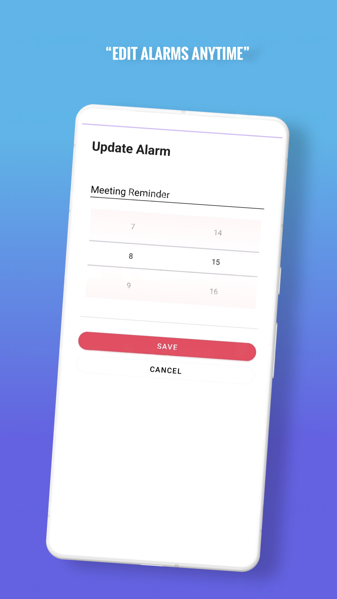
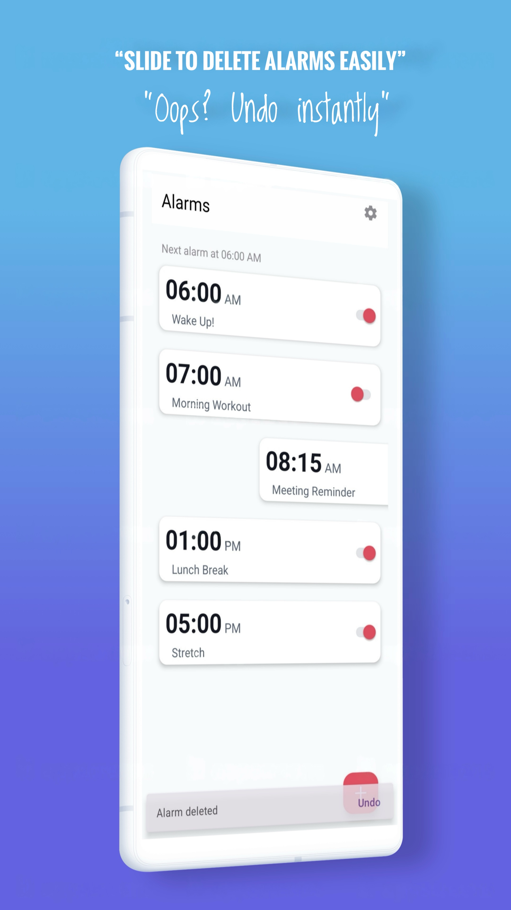

# ⏰ BuzzBuddy – Smart Alarm Manager (Android)

BuzzBuddy is a feature-rich alarm management application built using Kotlin and XML-based UI.  
The app demonstrates persistent alarm scheduling, reboot resilience, system service integration, and structured local data storage.

---

## 🚀 Features

- Add multiple alarms
- Swipe-to-delete with 10-second undo support
- Toggle alarm on/off
- Duplicate alarm time validation
- Alarm title display
- Gradual volume ramp-up for smooth wake-up
- Snooze duration control (0–60 minutes)
- Vibration toggle
- Multiple alarm sounds
- Dismiss alarm directly from notification panel
- Auto-disable alarm option
- Reboot-safe alarm rescheduling

---

## 🛠 Tech Stack

- Kotlin
- XML Layouts
- Room Database
- AlarmManager
- BroadcastReceiver
- BootReceiver
- SharedPreferences
- RecyclerView
- ItemTouchHelper
- Notifications API

---

## 🏗 Architecture Overview

### 📦 Data Persistence
- Alarms are stored using **Room Database**
- Duplicate alarms are prevented via database-level validation
- User preferences stored using **SharedPreferences**

### ⏰ Alarm Scheduling
- Uses **AlarmManager** for scheduling alarms
- **AlarmReceiver** handles alarm trigger events
- **BootReceiver** listens for device reboot and reschedules active alarms
- `RECEIVE_BOOT_COMPLETED` permission implemented

### 🖱 User Interaction
- RecyclerView for alarm list
- Swipe-to-delete using ItemTouchHelper
- Undo delete logic using Snackbar
- Toggle switch updates persistent state

---

## 📂 Project Structure (Simplified)

BuzzBuddy/
│
├── app/
│   ├── model/
│   ├── room/
│   ├── receiver/
│   ├── fragments/
│   └── activities/
│
└── README.md

---

## ▶️ How to Run

1. Clone the repository
2. Open in Android Studio
3. Sync Gradle
4. Run on physical device or emulator

---

## 📌 Concepts Demonstrated

- Android system service integration
- Persistent background scheduling
- Reboot-safe alarm handling
- Structured local database design
- State management using SharedPreferences
- UI interaction with RecyclerView & swipe gestures

---

## 📸 Screenshots

### 🏠 Home Screen

### ⏰ Active Alarm Screen

### ✏️ Set Alarm Title

### 🔄 Update Alarm

### 🗑 Swipe to Delete with Undo

