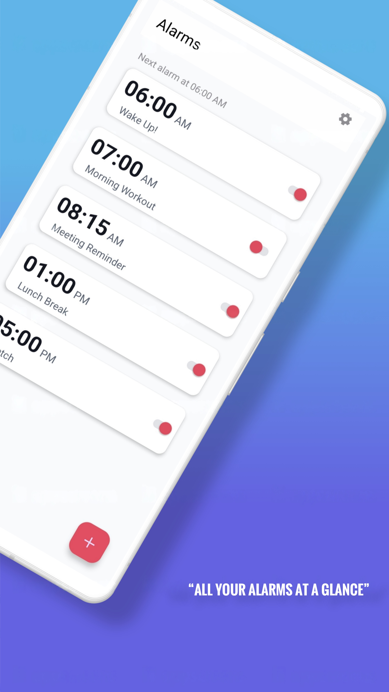
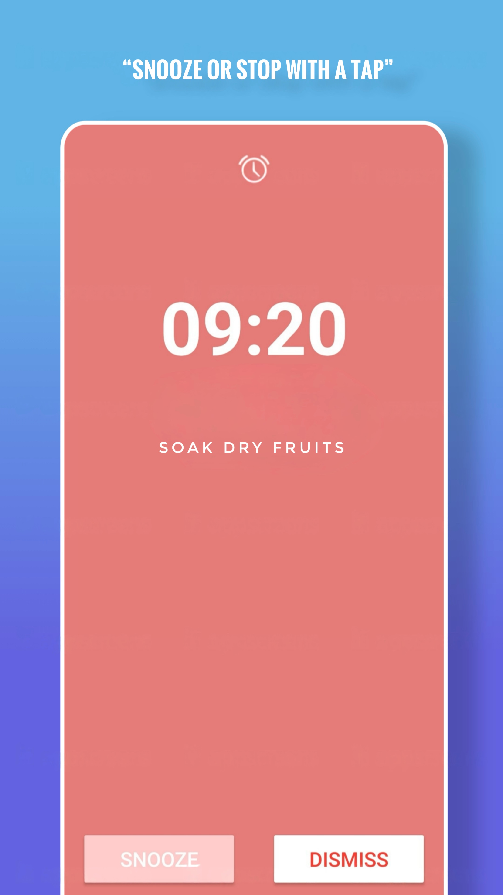
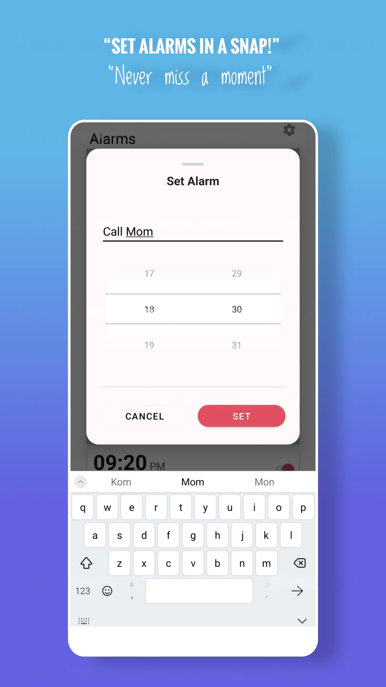
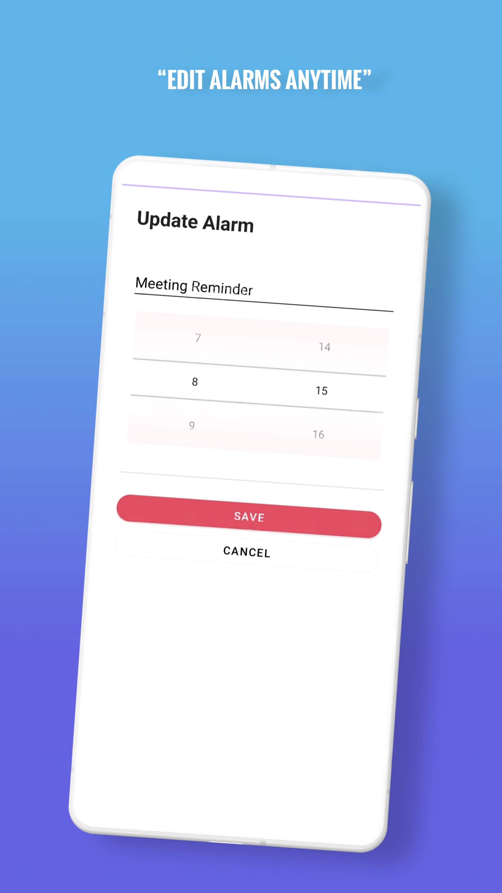
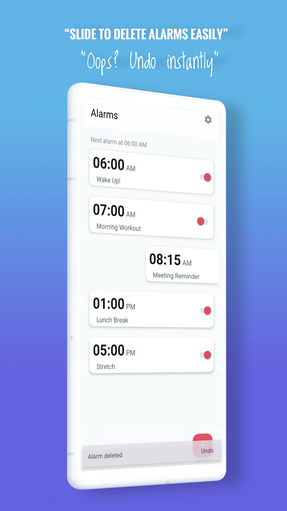

# ⏰ BuzzBuddy – Smart Alarm Manager (Android + API)

BuzzBuddy is a feature-rich alarm management application built using Kotlin and XML-based UI.
The app demonstrates persistent alarm scheduling, reboot resilience, system service integration, and structured local data storage.

On this `backend` branch you sign in first. After login, the alarm experience matches `main`.

---

## 🚀 Features

- Add multiple alarms
- Swipe-to-delete with 10-second undo support
- Toggle alarm on/off
- Duplicate alarm time validation
- Alarm title display
- Gradual volume ramp-up for smooth wake-up
- Snooze duration control (0–60 minutes)
- Vibration toggle
- Multiple alarm sounds
- Dismiss alarm directly from notification panel
- Auto-disable alarm option
- Reboot-safe alarm rescheduling

---

## 🛠 Tech Stack

- Kotlin
- XML Layouts
- Room Database
- AlarmManager
- BroadcastReceiver
- BootReceiver
- SharedPreferences
- RecyclerView
- ItemTouchHelper
- Notifications API

---

## 🏗 Architecture Overview

### 📦 Data Persistence
- Alarms are stored using **Room Database**
- Duplicate alarms are prevented via database-level validation
- User preferences stored using **SharedPreferences**

### ⏰ Alarm Scheduling
- Uses **AlarmManager** for scheduling alarms
- **AlarmReceiver** handles alarm trigger events
- **BootReceiver** listens for device reboot and reschedules active alarms
- `RECEIVE_BOOT_COMPLETED` permission implemented

### 🖱 User Interaction
- RecyclerView for alarm list
- Swipe-to-delete using ItemTouchHelper
- Undo delete logic using Snackbar
- Toggle switch updates persistent state

---

## ▶️ How to Run

1. Clone the repository
2. Open in Android Studio
3. Sync Gradle
4. Run on physical device or emulator

---

## 📌 Concepts Demonstrated

- Android system service integration
- Persistent background scheduling
- Reboot-safe alarm handling
- Structured local database design
- State management using SharedPreferences
- UI interaction with RecyclerView & swipe gestures

---

## 📸 Screenshots

### 🏠 Home Screen


### ⏰ Active Alarm Screen


### ✏️ Set Alarm Title


### 🔄 Update Alarm


### 🗑 Swipe to Delete with Undo


---

## Backend (this branch)

This branch is the same finished Android alarm app as `main`, plus login and FastAPI sync. After you sign in, the home screen, snooze, lock-screen ringing, and reboot reschedule match `main`.

```
Android (Retrofit + Room)  →  FastAPI  →  SQLite
```

| Method | Path | Auth | Description |
|--------|------|------|-------------|
| POST | `/api/register` | No | `{ name, email, password }` (password min 6 characters) |
| POST | `/api/login` | No | `{ email, password }` → `{ access_token, refresh_token, token }` |
| POST | `/api/auth/refresh` | Refresh JWT | Rotate tokens |
| POST | `/api/auth/logout` | Yes | Revoke refresh token |
| POST | `/api/auth/password-reset/request` | No | Always 200; code is emailed or logged |
| POST | `/api/auth/password-reset/confirm` | No | `{ email, code, new_password }` |
| GET | `/api/account/me` | Yes | Current user `{ id, name, email }` |
| PUT | `/api/account/password` | Yes | Change password |
| DELETE | `/api/account` | Yes | Delete user + alarms |
| GET/POST | `/api/alarms` | Yes | List / create |
| PUT/DELETE | `/api/alarms/{id}` | Yes | Update / delete (404 if not owner) |

Errors: `{ "error": "Human-readable message" }`

### Run the API

```bash
cd backend
python3 -m venv .venv
source .venv/bin/activate
pip install -r requirements.txt
cp .env.example .env
uvicorn app.main:app --host 0.0.0.0 --port 8080
```

- Health: http://127.0.0.1:8080/health
- Docs: http://127.0.0.1:8080/docs

Password-reset codes print in that terminal when `SMTP_HOST` is empty.

### Run the Android app

1. Keep uvicorn running (`--host 0.0.0.0 --port 8080`).
2. `BASE_URL` in `app/build.gradle.kts`:
   - Emulator: `http://10.0.2.2:8080/`
   - Physical phone: `http://YOUR_MAC_LAN_IP:8080/` (example: `http://192.168.1.39:8080/`)
3. Gradle JDK must be **17** (not 25). Homebrew: `/opt/homebrew/opt/openjdk@17`
4. Register first (password at least 6 characters), then log in.
5. Home screen after login is the same alarm list as `main`.

```bash
export JAVA_HOME=/opt/homebrew/opt/openjdk@17
./gradlew :app:assembleDebug
```

Do not commit `.env`, keystores, or `Buzz_Buddy.txt`.

